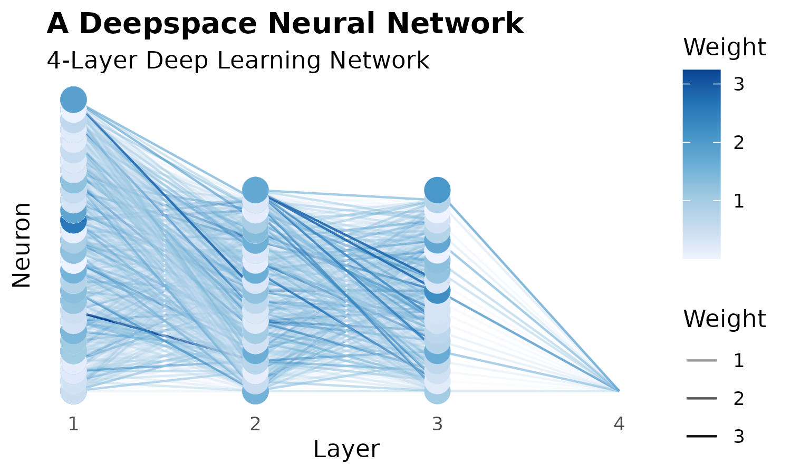

# deepspace 

###  A Simple R Package for Estimating Neural Network Clasifiers

## Introduction

This R package provides a simple API for estimating neural network classifiers
in R. The neural network itself is implemented using a C++ backend and is linked
to R via Rcpp. While this implementation can be used for a wide variety of
classification problems, this package contains functions for capturing and
loading images captured using a webcam for the purpose of training a model.
The package is designed to work with linux based systems (image capture is
performed using `fswebcam`). Originally designed as my project for ISYE 6740.

## Getting Started

To get started simply install the package from GitHub:

```r
devtools::install_github("https://github.com/walkerjameschris/deepspace")
```

To train a network, load the package and data. The `fit_network()` function
accepts the training data and labels (one hot encoded) as matrices. You can tune
the number of hidden layer neurons (`neurons`) in addition to the learning rate
(`alpha`) , max number of iterations (`epoch`), and a random seed.

```r
data <- deepspace:::mnist

network <-
  deepspace::fit_network(
    X = data$X,
    Y = data$Y,
    neurons = 5,
    epoch = 1000,
    learn_rate = 0.0001
  )

predict(network)

plot(network)
```



